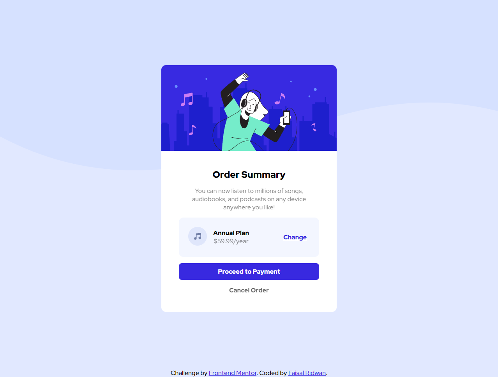

# Frontend Mentor - Order summary card solution

This is a solution to the [Order summary card challenge on Frontend Mentor](https://www.frontendmentor.io/challenges/order-summary-component-QlPmajDUj). Frontend Mentor challenges help you improve your coding skills by building realistic projects. 

## Table of contents

- [Overview](#overview)
  - [The challenge](#the-challenge)
  - [Screenshot](#screenshot)
  - [Links](#links)
- [My process](#my-process)
  - [Built with](#built-with)
  - [What I learned](#what-i-learned)
  - [Continued development](#continued-development)
- [Author](#author)

**Note: Delete this note and update the table of contents based on what sections you keep.**


## Overview

### The challenge

Users should be able to:

- See hover states for interactive elements

### Screenshot



### Links

- Solution URL: [Add solution URL here](https://your-solution-url.com)
- Live Site URL: [Live Site at Netlify](https://jade-lolly-b53af7.netlify.app/)


## My process

### Built with

- Flexbox
- Media queries
- CSS custom properties

### What I learned

- I learned how to use the css variable which I don't use it usually because I prefer to use styled-component when I work with React.
```css
:root {
    /* primary */
    --bright-blue: hsl(245, 75%, 52%);
    --pale-blue: hsla(225, 100%, 94%, 0.959);
    /* neutral */
    --dark-blue: hsl(223, 47%, 23%);
    --very-pale-blue: hsl(225, 100%, 98%);
    --desaturated-blue: hsl(224, 23%, 55%);
}

body {
    background-repeat: no-repeat;
    background-color: var(--pale-blue);
    background-image: url(./images/pattern-background-mobile.svg);
}
```

- Funny thing that I just know that we can set border-radius just for specific corner
```css
.card-content {
    gap: 1rem;
    padding: 10%;
    border-bottom-left-radius: 12px;
    border-bottom-right-radius: 12px;
    background-color: rgb(255, 255, 255);
}
```

### Continued development

Still curious about another CSS or SCSS features since usually I work with styled-components


## Author

- Website - [Faisal Ridwan](https://faisalridwan.site/)
- Frontend Mentor - [@faisalridwan55](https://www.frontendmentor.io/profile/faisalridwan55)
- Twitter - [@Faisal_tr](https://twitter.com/Faisal_tr)
